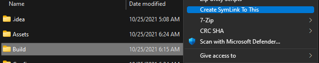

# WinLinkCreator

This small tool allows you to create symbolink link via shell extension

It can create both relative and absolute links with simple right-click and Save File Dialog.

For compiled version look into `Release-AnyCPU` directory. Shell extension can be installed with `install.bat`.
